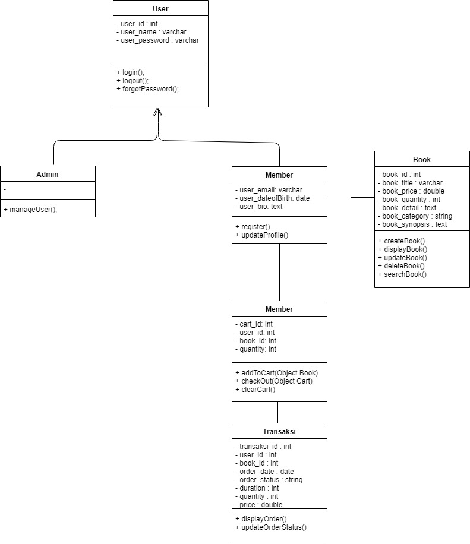
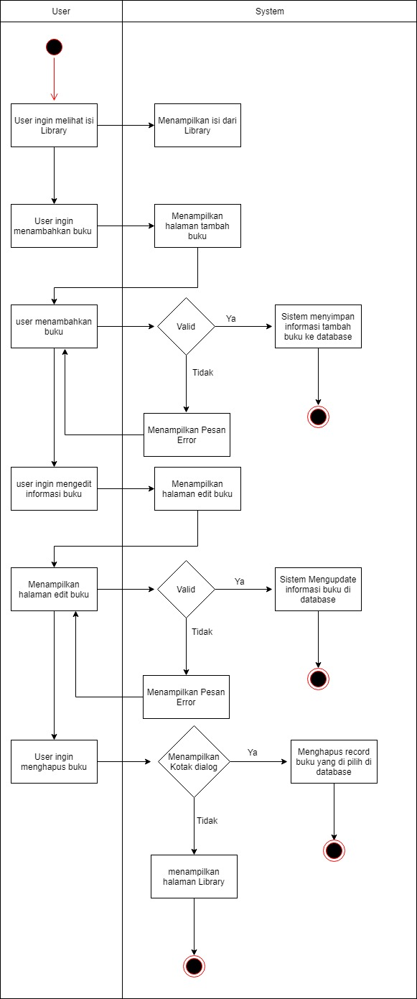
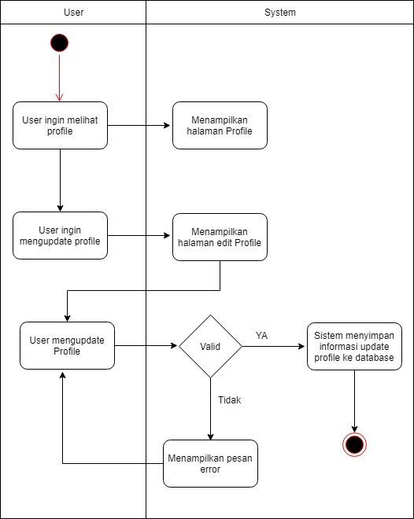
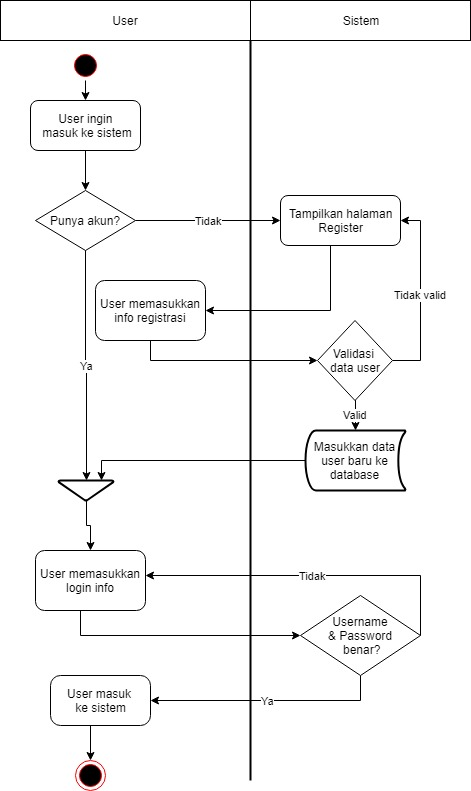

# PSBO-10
Object oriented programming project.

# iRentBook
iRentBook adalah sebuah aplikasi yang menyediakan sarana untuk menyewa dan menyewakan buku secara online. Aplikasi ini bertujuan untuk mempermudah orang-orang untuk menemukan buku yang diinginkan tanpa mengeluarkan cost yang besar serta bisa memanfaatkan buku yang tidak terpakai untuk mendapatkan penghasilan.

## Latar Belakang
Seperti yang kita tahu, di dunia perkuliahan setiap semester pasti mengambil mata kuliah yang berbeda dan pastinya juga buku-buku pendukung perkuliahan hanya dipakai selama satu semester, kecuali buku-buku tersebut dipakai untuk penunjang di mata kuliah lain.

## Lingkungan Pengembangan
### 1. Hardware
a. Windows 10 Home  
b. Intel Core i7, NVIDIA GTX950M  
c. RAM 8GB

### 2. Software
a. Android Studio (Java)  
b. Firebase  
c. SQLite  

## Dokumentasi
### Class Diagram

  

### Use Case Diagram

  

### Activity Diagram
+ Activity Diagram CRUD Library

  

+ Activity Diagram Proses Order

  

+ Activity Diagram Read and update Profile

  

+ Activity Diagram Register and Login

+ Activity Diagram Search Buku

